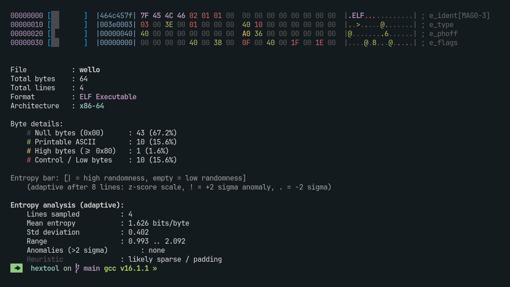

# hextool

> A fast, colorful, and feature-rich hexdump utility written in C.

`hextool` is a modern alternative to the classic `hexdump` / `xxd` commands. It provides colored output, entropy visualization, ELF header parsing, pattern search with highlighting, reverse hexdump, and detailed byte statistics, all in a single lightweight binary.


## Features

| Feature | Description |
|---------|-------------|
| **Colored Hex Dump** | Bytes are color-coded by type , null, printable ASCII, high bytes, control/low bytes, ELF magic, and search matches |
| **Entropy Visualization** | Per-line entropy bar using Shannon entropy to spot encrypted / compressed / random data at a glance |
| **ELF Header Parsing** | Auto-detects ELF files, identifies architecture (x86, x86-64, ARM, AArch64, MIPS, RISC-V, PowerPC, etc.), and annotates ELF header fields |
| **Pattern Search** | Search and highlight hex byte sequences (`-s`) or ASCII strings (`-S`) directly in the dump |
| **Reverse Hexdump** | Convert a hexdump text file back into binary (`-r`) , supports ANSI-colored dumps |
| **Offset & Length Control** | Dump from a specific offset (`-o`) and limit the number of bytes (`-n`) |
| **Inline String Detection** | Automatically extracts printable strings (≥4 chars) found within each 16-byte line |
| **Little-Endian Preview** | Displays the first 4 bytes as a little-endian 32-bit value on every line |
| **Byte Statistics** | End-of-dump summary showing null bytes, printable ASCII, high bytes, and control bytes with percentages |
| **Color Toggle** | Disable colors with `-c` for piping or redirecting output |
| **Fast I/O** | Uses 64 KiB buffered output and `posix_fadvise` on Linux for sequential read optimization |
| **Unit Tested** | Includes a built-in test suite (`make test`) covering CLI parsing, ELF detection, pattern matching, and reverse hexdump |


## Installation

### Requirements

- **GCC** or **Clang** with C17 support
- POSIX-compliant system (Linux, macOS, *BSD)
- `make`

### Build

```bash
git clone https://github.com/kosanlabs/hextool.git
cd hextool
make
```

### Run Tests

```bash
make test
```

### Clean Build Artifacts

```bash
make clean
```

## Usage

```
hextool [options] <input> [output]
```

### Dump Mode (default)

```bash
hextool [options] <file>
```

### Reverse Mode

```bash
hextool -r <dump.txt> <output.bin>
```

### Diff Mode

```bash
hextool -d <file2> <file>
```

Compares two files byte by byte, highlighting differing bytes in each line.
Exits `0` when identical, `1` when files differ, `2` on error.

### Options

| Flag | Long | Argument | Description |
|------|------|----------|-------------|
| `-h` | `--help` |  | Show help message |
| | `--version` |  | Show version |
| `-o` | | `<offset>` | Start dump at offset (hex `0x...` or decimal) |
| `-n` | | `<length>` | Limit number of bytes to dump |
| `-s` | | `<hex>` | Search & highlight hex pattern (e.g. `7f454c46`) |
| `-S` | | `<string>` | Search & highlight ASCII pattern (e.g. `flag{`) |
| `-c` | |  | Disable colored output |
| `-r` | |  | Reverse hexdump: convert dump text back to binary |
| `-d` | | `<file>` | Diff mode: compare input against `<file>` |


## Examples

### Basic Hex Dump

```bash
./hextool /bin/ls
```

### Search for ELF Magic Number

```bash
./hextool -s 7f454c46 /bin/ls
```

### Search for a CTF Flag String

```bash
./hextool -S "flag{" challenge.bin
```

### Disable Colors (for piping)

```bash
./hextool -c /bin/ls > dump.txt
```

### Reverse Hexdump Back to Binary

```bash
./hextool -r dump.txt recovered.bin
```

### Dump 256 Bytes from Offset `0x1000`

```bash
./hextool -o 0x1000 -n 256 /bin/ls
```

### Dump Only the ELF Header (64 bytes)

```bash
./hextool -n 64 /bin/ls
```

### Combined: Offset + Length + String Search

```bash
./hextool -o 0x2f20 -n 128 -S "libc" /bin/ls
```


## Output Format



## Architecture Support

`hextool` recognizes the following ELF machine types:

| Machine ID | Architecture |
|------------|--------------|
| `0x00` | No specific |
| `0x02` | SPARC |
| `0x03` | x86 |
| `0x08` | MIPS |
| `0x14` | PowerPC |
| `0x15` | PowerPC64 |
| `0x16` | S390 |
| `0x28` | ARM |
| `0x2A` | SuperH |
| `0x32` | IA-64 |
| `0x3E` | x86-64 |
| `0xB7` | AArch64 |
| `0xF3` | RISC-V |


### Module Responsibilities

| Module | Responsibility |
|--------|----------------|
| `main.c` | Validates CLI arguments, opens files, routes to dump or reverse mode, handles `SIGPIPE`, prints summary |
| `cli.c` | Parses `-o`, `-n`, `-s`, `-S`, `-c`, `-r`, `--help`, `--version`; validates argument combinations |
| `dump.c` | Reads file in 16-byte chunks, calls formatters, accumulates statistics, applies `posix_fadvise` on Linux |
| `format.c` | Computes Shannon entropy, renders entropy bar, formats hex/ASCII columns, extracts inline strings |
| `color.c` | Maps byte values to ANSI color codes; supports global color enable/disable |
| `pattern.c` | Converts hex strings (with optional spaces) or ASCII strings to byte patterns; performs sliding-window matching |
| `elf.c` | Detects ELF magic (`0x7FELF`), reads `e_machine` at offset 18, maps to architecture string, annotates header fields |
| `stats.c` | Calculates percentages for null / printable / high / control bytes; prints formatted summary |
| `reverse.c` | Parses hexdump lines (with ANSI codes), extracts offset and hex bytes, seeks and writes to output file |


## Technical Highlights

- **C17 standard** with POSIX.1-2008 extensions
- **64-bit file offsets** via `_FILE_OFFSET_BITS=64`
- **Buffered stdout** (64 KiB) to minimize syscall overhead
- **`posix_fadvise(POSIX_FADV_SEQUENTIAL)`** on Linux for kernel read-ahead hints
- **ANSI-aware reverse parser**: skips escape sequences when reconstructing binary
- **Safe offset handling**: validates that `-o` offset does not exceed file size
- **Directory guard**: rejects directories early with a clear error message


## Acknowledgments

Inspired by the classic `hexdump`, `xxd`, and `binwalk` tools. Built for reverse engineering, CTFs, and binary analysis workflows.

